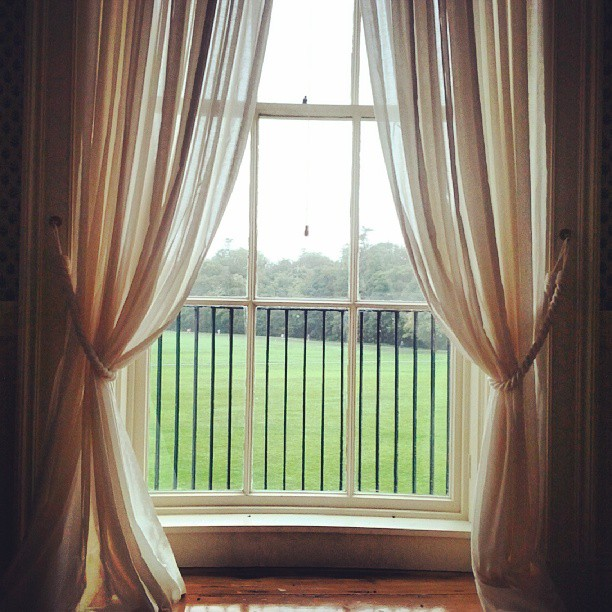

.. Arcadia documentation master file, created by
   sphinx-quickstart on Tue Apr 25 00:48:49 2017.
   You can adapt this file completely to your liking, but it should at least
   contain the root `toctree` directive.

Et in Arcadia Ego
=================

*A game of magic, manners, and madness in Jane Austen's England.*

    .. rubric:: What am I looking for here?
       :name: what-am-i-looking-for-here

    I've got a couple questions for readers.

    The big one is this: what's unclear and what's missing? I have the
    distinct feeling that there are things that have not made it from my
    head to the page, and if you feel like there's a beat missing, or an
    idea insufficiently explained, please tell me.

    The next is this: do these rules seem like they'll work? I've tried
    a lot of them at the table, but if anything gives you reservations
    or makes you confused, I'd love to know.

    Third: I'm looking for places to tighten the *relationships* between
    systems. Where something you do here should have consequences there. Let me
    know if there are fruitful interactions you see that I'm missing.

    Finally: does this excite you? Would you want to play a couple games
    in this world, can you imagine characters whose situations and
    development would keep you interested?

    Thanks!

.. toctree::
   :maxdepth: 2
   :caption: Contents:

   01_what_is_this
   02_how_do_we_play
   03_what_a_game_looks_like
   04_this_other_regency
   05_the_magic_of_england
   06_starting_the_game
   07_rules_for_making_characters
   08_rules_for_petition
   09_rules_for_exertion
   10_rules_for_impression
   11_rules_for_magic
   12_rules_for_the_gm
   13_rules_for_how_characters_change_and_grow
   14_appendix_passions
   15_appendix_social_roles
   16_appendix_fairies
   17_appendix_names
